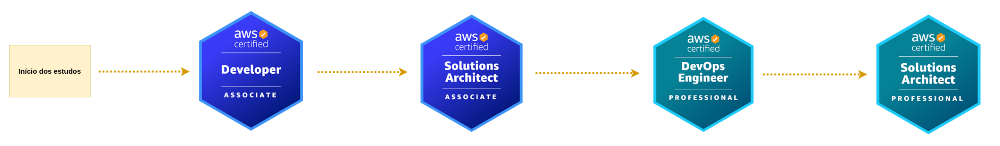

# Sobre o repositório

- A ideia desse repositório é criar um ambiente de estudo direcionado aos recursos da AWS.

https://aws.amazon.com/architecture/reference-architecture-diagrams/?solutions-all.sort-by=item.additionalFields.sortDate&solutions-all.sort-order=desc&whitepapers-main.sort-by=item.additionalFields.sortDate&whitepapers-main.sort-order=desc&awsf.whitepapers-tech-category=*all&awsf.whitepapers-industries=*all&whitepapers-main.q=serverless&whitepapers-main.q_operator=AND&awsm.page-whitepapers-main=4

# Ferramentas de estudo

### Arquitetura AWS - Blog

https://aws.amazon.com/blogs/architecture/category/application-integration/

https://aws.amazon.com/blogs/architecture/lets-architect-serverless-architecture-on-aws/

### AWS Architect Labs

- https://wellarchitectedlabs.com/

### Plano de certificações

## Desenhos

https://arcentry.com/

Drawio

## Links úteis

https://aws.amazon.com/architecture/reference-architecture-diagrams/?solutions-all.sort-by=item.additionalFields.sortDate&solutions-all.sort-order=desc&whitepapers-main.sort-by=item.additionalFields.sortDate&whitepapers-main.sort-order=desc&awsf.whitepapers-tech-category=*all&awsf.whitepapers-industries=*all#Filter_by.3A

https://aws.amazon.com/pt/architecture/?cards-all.sort-by=item.additionalFields.sortDate&cards-all.sort-order=desc&awsf.content-type=content-type%23reference-arch-diagram&awsf.methodology=*all&awsf.tech-category=*all&awsf.industries=*all&awsm.page-cards-all=1

## Arquiteturas de referência

https://d1.awsstatic.com/architecture-diagrams/ArchitectureDiagrams/aws-reference-architecture-hybrid-domain-consistency-ra.pdf?did=wp_card&trk=wp_card

https://d1.awsstatic.com/architecture-diagrams/ArchitectureDiagrams/serverless-strategy-for-dynamic-pricing-ra.pdf

https://d1.awsstatic.com/architecture-diagrams/ArchitectureDiagrams/serverless-reservation-system-on-aws-ra.pdf?did=wp_card&trk=wp_card
