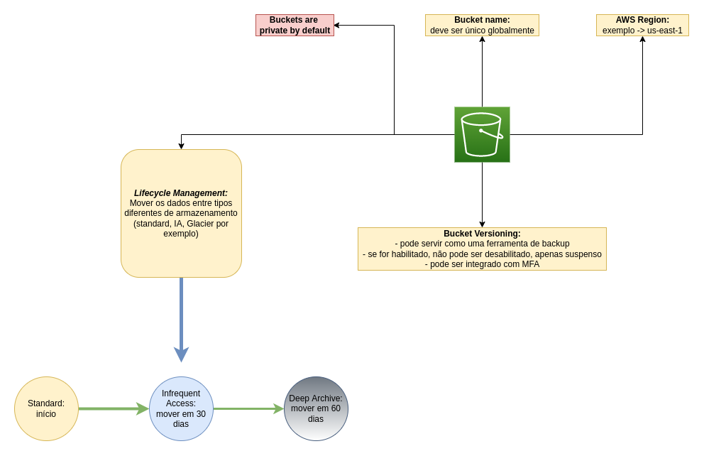
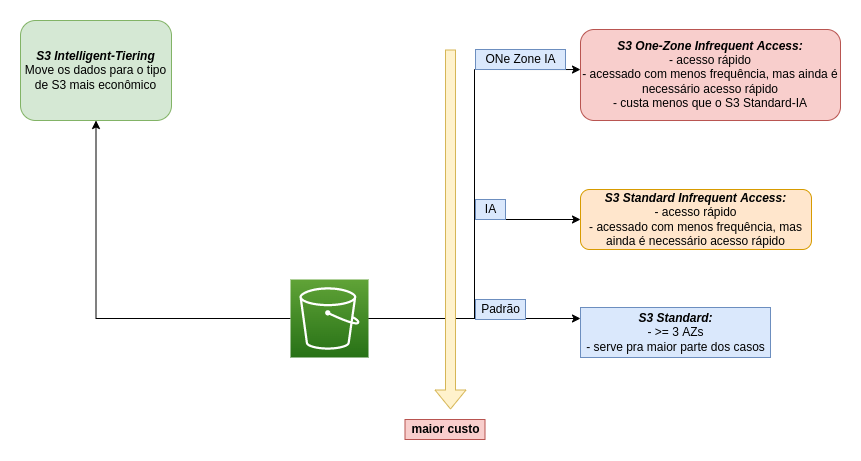
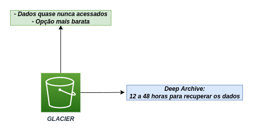
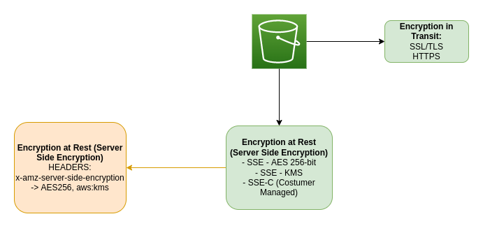

# S3: Simple Storage Service

- Def documentação: "Amazon Simple Storage Service (Amazon S3) is an object storage service that offers industry-leading scalability, data availability, security, and performance. Customers of all sizes and industries can use Amazon S3 to store and protect any amount of data for a range of use cases, such as data lakes, websites, mobile applications, backup and restore, archive, enterprise applications, IoT devices, and big data analytics.".

doc: https://docs.aws.amazon.com/AmazonS3/latest/userguide/Welcome.html

## Características gerais

- S3 Buckets
- Os nomes dos buckets são devem ser unicos universalmente (entre todas as contas da AWS)
- https://nome-do-bucket.s3.region.amazonaws.com/key-name
- exemplo: https://meu-bucket.s3.us-east-1.amazonaws.com/arquivo.jpg
- key: nome do objeto armazenado
- value: os dados
- version-id: versão do objeto
- metadata: metadados (last-modified, content-type etc)
- Arquivos até 5TB
- Unlimited Storage
- Não podemos armazenar sistemas operacionais nem database

## S3 Standard

Versão padrão;
Dados são armazenados em, no mínimo, 3 Availability Zones;

## Segurança

- Criptografia do lado do servidor (server side encryption)
- ACL: Access Control Lists
- Bucket Policies (ações permitidas ou negadas)
- "Srong Read-After-Write Consistency": sempre pegar a versão mais atualizada do objeto

## Desenhos

### Características gerais

### Tipos de armazenamentos do S3

### Glacier e Deep Archive [mais baratos]

### Criptografia dos dados em trânsito e armazenados

